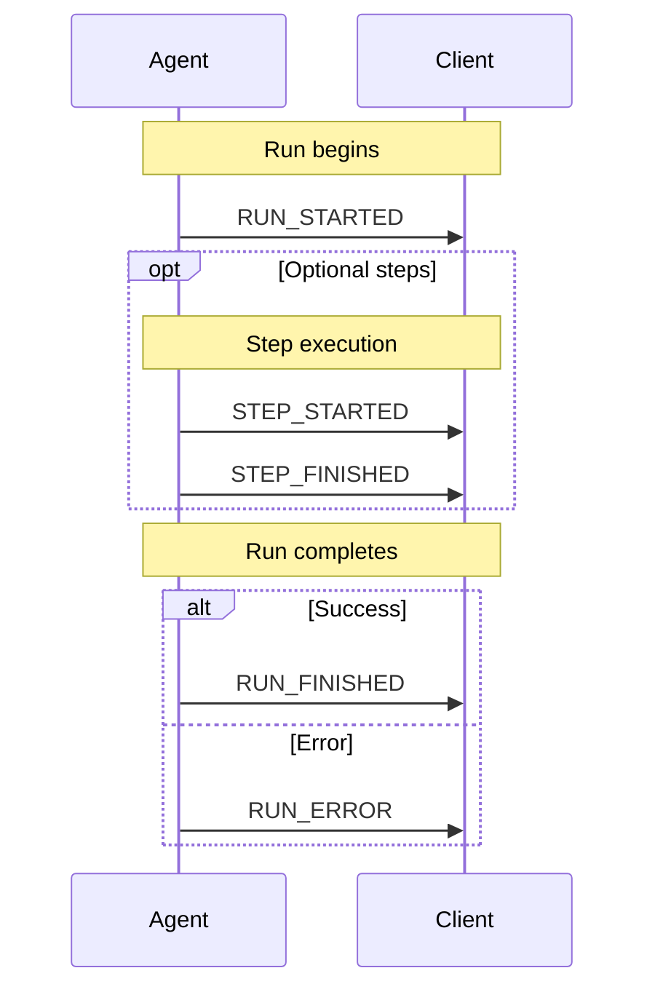
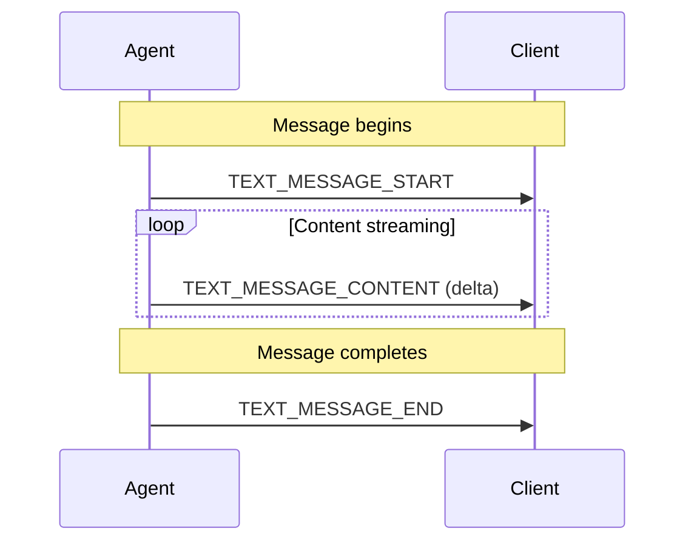
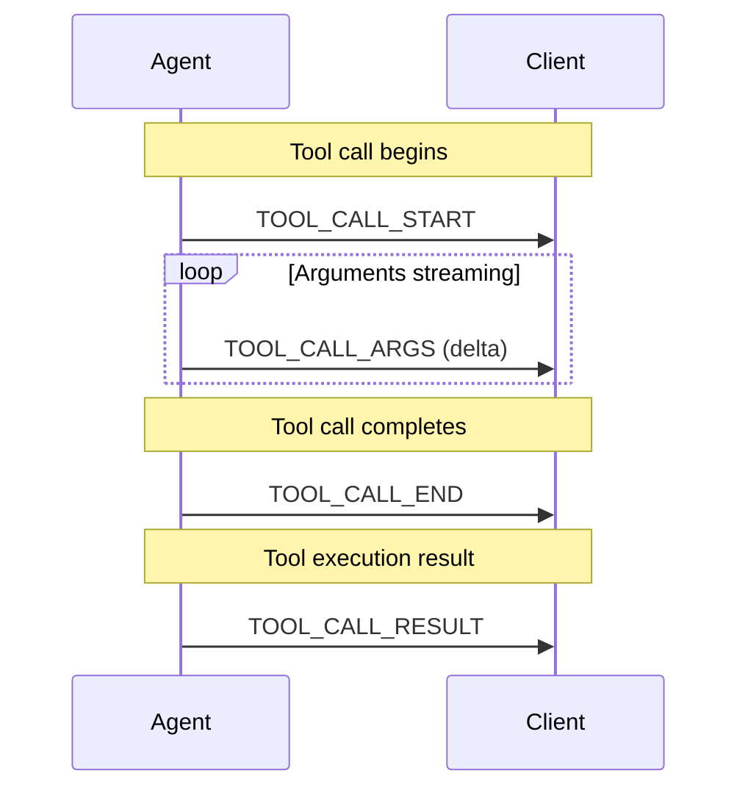
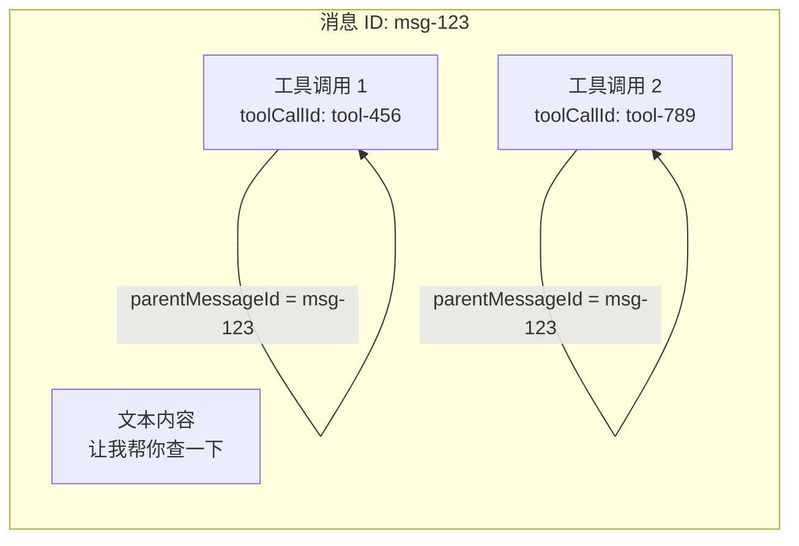
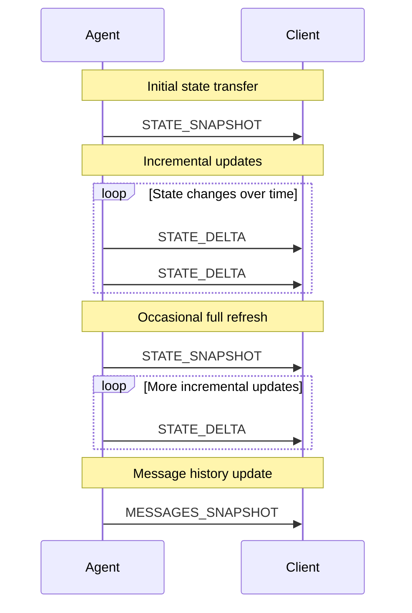
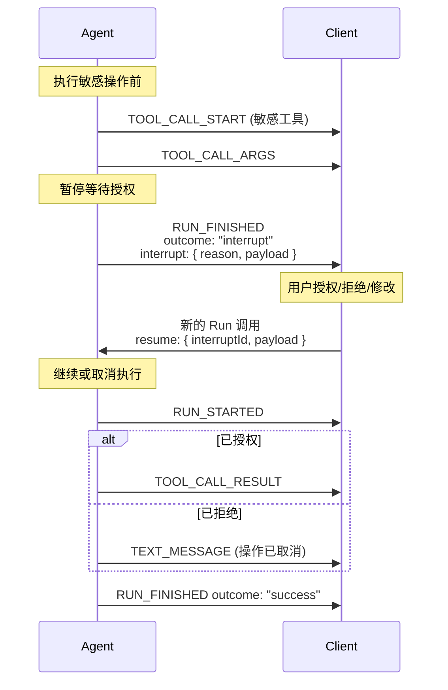
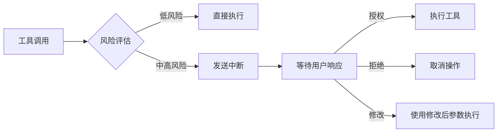

# AG-UI 事件类型全解析：构建 AI 代理与 UI 的实时通信桥梁

> 深入理解 AG-UI 协议的 26 种事件类型，掌握 AI 代理与前端交互的核心机制

## 前言

AG-UI (Agent-User Interaction Protocol) 是一个开放、轻量级的基于事件协议，用于标准化 AI 代理与用户界面应用的连接方式。在本文中，我们将深入了解 AG-UI 协议的核心——**事件类型系统**，了解这 26 种事件类型如何实现代理与前端之间的实时、结构化通信。

`★ Insight ─────────────────────────────────────`

- **事件驱动架构**：AG-UI 采用 SSE (Server-Sent Events) 作为默认传输方式，所有事件都是单向从代理流向前端，避免了传统 WebSocket 的双向复杂性
- **渐进式流式传输**：通过 START-CONTENT-END 三阶段模式，AG-UI 支持增量内容传输，让用户实时看到 AI 的思考和响应过程
- **多语言统一设计**：协议在 TypeScript、Python、Kotlin、Java 等语言中保持一致的事件定义，确保跨平台互操作性
  `─────────────────────────────────────────────────`

## 事件架构概览

### 基础事件结构

所有 AG-UI 事件都继承自 `BaseEvent`，包含以下通用属性：

```typescript
interface BaseEvent {
  type: EventType; // 事件类型枚举
  timestamp?: number; // 可选的时间戳
  rawEvent?: any; // 原始事件数据（用于调试）
}
```

### 事件分类总览

| 类别         | 事件数量 | 用途                                         |
| ------------ | -------- | -------------------------------------------- |
| 生命周期事件 | 5        | 监控代理运行的完整生命周期（支持 HITL 中断） |
| 文本消息事件 | 4        | 处理流式文本消息传输                         |
| 工具调用事件 | 5        | 管理代理的工具执行流程                       |
| 思考过程事件 | 5        | 展示 AI 的推理链过程                         |
| 状态管理事件 | 3        | 同步代理状态到前端                           |
| 活动事件     | 2        | 支持生成式 UI 组件                           |
| 扩展事件     | 2        | 支持自定义和原始事件                         |

> **HITL 支持**：通过 `RUN_FINISHED` 事件的 `outcome: "interrupt"` 扩展实现人工介入（详见第八章）

---

## 一、生命周期事件 (Lifecycle Events)

生命周期事件提供代理执行的宏观视图，帮助前端跟踪整个运行过程。



### 1.1 RUN_STARTED

代理运行开始时发送，标志着一次新的交互会话启动。

```typescript
type RunStartedEvent = BaseEvent & {
  type: EventType.RUN_STARTED;
  threadId: string; // 会话线程 ID
  runId: string; // 本次运行唯一标识
  parentRunId?: string; // 父运行 ID（支持嵌套调用）
  input?: RunAgentInput; // 代理输入参数
};
```

### 1.2 RUN_FINISHED

代理运行完成时发送（包括成功完成、中断等情况）。

```typescript
type RunFinishedEvent = BaseEvent & {
  type: EventType.RUN_FINISHED;
  threadId: string;
  runId: string;
  result?: any; // 运行结果（成功时）

  // 🎯 HITL 扩展（草案阶段）
  outcome?: "success" | "interrupt"; // 运行结果类型
  interrupt?: {
    id?: string; // 中断 ID
    reason?: string; // 中断原因：如 "human_approval", "tool_authorization"
    payload?: any; // 自定义 UI 数据（表单、提案等）
  };
};
```

#### HITL 中断模式（草案）

当代理需要用户介入时（如工具授权、敏感操作确认），会发送带 `interrupt` 的 `RUN_FINISHED` 事件：

```typescript
// 工具授权示例
{
  type: "RUN_FINISHED",
  threadId: "thread-123",
  runId: "run-001",
  outcome: "interrupt",
  interrupt: {
    id: "auth-001",
    reason: "tool_authorization",
    payload: {
      tool: "delete_user",
      args: { userId: "12345" },
      riskLevel: "high"
    }
  }
}
```

用户响应后，通过 `RunAgentInput.resume` 继续执行（详见后文 HITL 专题）。

### 1.3 RUN_ERROR

代理运行出错时发送。

```typescript
type RunErrorEvent = BaseEvent & {
  type: EventType.RUN_ERROR;
  message: string; // 错误消息
  code?: string; // 错误码（可选）
};
```

### 1.4 STEP_STARTED & STEP_FINISHED

标记代理执行过程中的关键步骤开始和结束。

```typescript
type StepStartedEvent = BaseEvent & {
  type: EventType.STEP_STARTED;
  stepName: string; // 步骤名称
  stepId?: string; // 步骤 ID（可选）
};

type StepFinishedEvent = BaseEvent & {
  type: EventType.STEP_FINISHED;
  stepName: string;
  stepId?: string;
  output?: any; // 步骤输出（可选）
};
```

`★ Insight ─────────────────────────────────────`

- **嵌套运行支持**：通过 `parentRunId` 字段，AG-UI 支持代理的多层嵌套调用场景（如 Agent A 调用 Agent B）
- **错误处理机制**：`RUN_ERROR` 与 `RUN_FINISHED` 是互斥的，前端可以据此判断运行的成功或失败状态
- **HITL 扩展**：通过 `outcome: "interrupt"` 和 `interrupt` 字段支持人工介入，这是工具授权等场景的核心机制
  `─────────────────────────────────────────────────`

---

## 二、文本消息事件 (Text Message Events)

文本消息事件是 AG-UI 最核心的事件类型，实现流式文本响应。



### 2.1 TEXT_MESSAGE_START

开始一条新的文本消息。

```typescript
type TextMessageStartEvent = BaseEvent & {
  type: EventType.TEXT_MESSAGE_START;
  messageId: string; // 消息唯一 ID
  role?: TextMessageRole; // 角色：'assistant' | 'user' | 'system' | 'developer'
};
```

### 2.2 TEXT_MESSAGE_CONTENT

增量传输文本内容片段。

```typescript
type TextMessageContentEvent = BaseEvent & {
  type: EventType.TEXT_MESSAGE_CONTENT;
  messageId: string;
  delta: string; // 增量文本内容
};
```

### 2.3 TEXT_MESSAGE_END

标记文本消息传输完成。

```typescript
type TextMessageEndEvent = BaseEvent & {
  type: EventType.TEXT_MESSAGE_END;
  messageId: string;
};
```

### 2.4 TEXT_MESSAGE_CHUNK

便捷事件，自动展开为 START → CONTENT → END 序列。

```typescript
type TextMessageChunkEvent = BaseEvent & {
  type: EventType.TEXT_MESSAGE_CHUNK;
  messageId?: string; // 首个 chunk 时必需
  delta?: string; // 文本片段
};
```

**事件流示例**：

```
TEXT_MESSAGE_START (messageId: "msg_001")
  ↓
TEXT_MESSAGE_CONTENT (delta: "今")
  ↓
TEXT_MESSAGE_CONTENT (delta: "天天气")
  ↓
TEXT_MESSAGE_CONTENT (delta: "不错")
  ↓
TEXT_MESSAGE_END
```

---

## 三、工具调用事件 (Tool Call Events)

当代理需要调用外部工具（如搜索、计算器、API 等）时使用。



### 3.1 TOOL_CALL_START

开始一个工具调用。

```typescript
type ToolCallStartEvent = BaseEvent & {
  type: EventType.TOOL_CALL_START;
  toolCallId: string; // 工具调用唯一 ID
  toolName: string; // 工具名称
  parentMessageId?: string; // 父消息 ID
};
```

### 3.2 TOOL_CALL_ARGS

流式传输工具调用参数。

```typescript
type ToolCallArgsEvent = BaseEvent & {
  type: EventType.TOOL_CALL_ARGS;
  toolCallId: string;
  delta: string; // JSON 参数片段
};
```

### 3.3 TOOL_CALL_END

工具调用参数传输完成。

```typescript
type ToolCallEndEvent = BaseEvent & {
  type: EventType.TOOL_CALL_END;
  toolCallId: string;
};
```

### 3.4 TOOL_CALL_RESULT

工具执行结果返回。

```typescript
type ToolCallResultEvent = BaseEvent & {
  type: EventType.TOOL_CALL_RESULT;
  messageId: string;
  toolCallId: string;
  content: string; // 工具返回结果
  role?: "tool"; // 固定为 "tool"
};
```

### 3.5 TOOL_CALL_CHUNK

便捷事件，自动展开为工具调用**请求阶段**的事件序列（START → ARGS → END）。

```typescript
type ToolCallChunkEvent = BaseEvent & {
  type: EventType.TOOL_CALL_CHUNK;
  toolCallId?: string; // 首次调用时必需
  toolCallName?: string; // 首次调用时必需
  parentMessageId?: string;
  delta?: string; // 参数片段
};
```

**重要说明**：`TOOL_CALL_CHUNK` 仅展开为：

- `TOOL_CALL_START`
- `TOOL_CALL_ARGS`（可能有多个）
- `TOOL_CALL_END`

**不包含** `TOOL_CALL_RESULT`。`RESULT` 是代理框架在工具实际执行完毕后独立发送的事件，与 CHUNK 无关。

### 3.6 深入理解 parentMessageId

`parentMessageId` 是理解工具调用与消息关系的关键字段。

#### 核心概念

在 OpenAI / LangChain 的消息模型中，**工具调用是嵌入在 Assistant 消息内部的**。一条 Assistant 消息可以同时包含：

1. **文本内容**（如 "让我帮你查一下天气"）
2. **一个或多个工具调用**（如调用 `get_weather` 工具）



#### ID 关系对照表

| 字段              | 含义                                              | 示例值          |
| ----------------- | ------------------------------------------------- | --------------- |
| `messageId`       | Assistant 消息的唯一 ID                           | `"msg-abc123"`  |
| `toolCallId`      | 该消息中某个具体工具调用的 ID                     | `"call_xyz456"` |
| `parentMessageId` | **指向包含此工具调用的消息 ID**（即 `messageId`） | `"msg-abc123"`  |

#### 完整事件流示例

假设用户问 "北京和巴黎的天气如何？"，Agent 需要调用两次天气 API：

```
# 1. Assistant 开始回复
[TEXT_MESSAGE_START]
  messageId: "msg-001"
  role: "assistant"

# 2. 开始流式输出文本
[TEXT_MESSAGE_CONTENT]
  messageId: "msg-001"
  delta: "我来帮你查询"

# 3. 第一个工具调用开始
[TOOL_CALL_START]
  toolCallId: "call-001"
  toolName: "get_weather"
  parentMessageId: "msg-001"  ← 指向这条消息

[TOOL_CALL_ARGS]
  toolCallId: "call-001"
  delta: '{"city": "北京"}'

[TOOL_CALL_END]
  toolCallId: "call-001"

# 4. 第二个工具调用开始（同一条消息！）
[TOOL_CALL_START]
  toolCallId: "call-002"
  toolName: "get_weather"
  parentMessageId: "msg-001"  ← 还是同一条消息！

[TOOL_CALL_ARGS]
  toolCallId: "call-002"
  delta: '{"city": "巴黎"}'

[TOOL_CALL_END]
  toolCallId: "call-002"

# 5. 继续输出文本
[TEXT_MESSAGE_CONTENT]
  messageId: "msg-001"
  delta: "的天气..."

# 6. 消息结束
[TEXT_MESSAGE_END]
  messageId: "msg-001"

# 7. 工具返回结果
[TOOL_CALL_RESULT]
  messageId: "msg-res-001"    ← 注意：这是新创建的结果消息 ID
  toolCallId: "call-001"
  content: "北京今天晴天，25°C"

[TOOL_CALL_RESULT]
  messageId: "msg-res-002"    ← 不是 parentMessageId
  toolCallId: "call-002"
  content: "巴黎今天多云，18°C"
```

#### 为什么需要 parentMessageId？

1. **UI 关联**：前端需要知道将工具调用卡片显示在哪个消息气泡中
2. **消息上下文**：理解"为什么"调用这个工具（因为用户在对话中提到了相关需求）
3. **多工具调用支持**：当一条消息包含多个工具调用时，可以正确分组显示

#### OpenAI 消息格式对照

```typescript
// OpenAI 格式的 Assistant 消息
{
  "id": "msg-abc123",        // ← 这就是 parentMessageId 的来源
  "role": "assistant",
  "content": [
    {
      "type": "text",
      "text": "让我帮你查一下"
    },
    {
      "type": "tool_use",
      "id": "tool-456",       // ← 这是 toolCallId
      "name": "get_weather",
      "input": {"city": "北京"}
    }
  ]
}
```

#### LangGraph 集成中的实现

```typescript
// integrations/langgraph/typescript/src/agent.ts
if (isToolCallStartEvent && shouldEmitToolCalls) {
  const resolved = this.dispatchEvent({
    type: EventType.TOOL_CALL_START,
    toolCallId: toolCallData.id,
    toolName: toolCallData.name,
    parentMessageId: event.data.chunk.id, // 来自 LangGraph 消息的 chunk.id
    rawEvent: event,
  });
}
```

`★ Insight ─────────────────────────────────────`

- **一对多关系**：一条消息（`messageId`）可以包含多个工具调用（每个有独立的 `toolCallId`），但它们的 `parentMessageId` 都指向同一条消息
- **UI 渲染关键**：前端通过 `parentMessageId` 知道应该把工具调用 UI（如工具卡片、加载动画）显示在哪条消息气泡内部或旁边
- **与 ToolCallResult 的区别**：`TOOL_CALL_RESULT` 事件中的 `messageId` 是新创建的工具结果消息的 ID，而 `TOOL_CALL_START` 的 `parentMessageId` 指向发起调用的原始消息
  `─────────────────────────────────────────────────`

---

## 四、思考过程事件 (Thinking Events)

展示 AI 的推理链（Chain-of-Thought），让用户了解 AI 的思考过程。

### 4.1 THINKING_START

开始思考阶段。

```typescript
type ThinkingStartEvent = BaseEvent & {
  type: EventType.THINKING_START;
  title?: string; // 思考标题（可选）
};
```

### 4.2 THINKING_END

思考阶段结束。

```typescript
type ThinkingEndEvent = BaseEvent & {
  type: EventType.THINKING_END;
};
```

### 4.3 THINKING*TEXT_MESSAGE*\*

与文本消息事件类似的流式传输，用于展示思考内容：

- `THINKING_TEXT_MESSAGE_START`
- `THINKING_TEXT_MESSAGE_CONTENT`
- `THINKING_TEXT_MESSAGE_END`

`★ Insight ─────────────────────────────────────`

- **透明的 AI 推理**：Thinking 事件让 AI 的"黑盒"决策过程变得可见，增强用户信任
- **嵌套结构**：Thinking 可以与 Tool Call 交错发生，真实反映 AI 的思考-行动循环
  `─────────────────────────────────────────────────`

---

## 五、状态管理事件 (State Management Events)

用于同步代理状态到前端，支持状态可视化和调试。



### 5.1 STATE_SNAPSHOT

发送完整的状态快照。

```typescript
type StateSnapshotEvent = BaseEvent & {
  type: EventType.STATE_SNAPSHOT;
  snapshot: State; // 完整状态对象
};
```

### 5.2 STATE_DELTA

发送状态增量更新（使用 JSON Patch 格式 RFC 6902）。

```typescript
type StateDeltaEvent = BaseEvent & {
  type: EventType.STATE_DELTA;
  delta: any[]; // JSON Patch 操作数组
};
```

### 5.3 MESSAGES_SNAPSHOT

发送对话历史消息快照。

```typescript
type MessagesSnapshotEvent = BaseEvent & {
  type: EventType.MESSAGES_SNAPSHOT;
  messages: Message[]; // 消息数组
};
```

---

## 六、活动事件 (Activity Events)

支持生成式 UI（Generative UI），允许代理动态生成前端组件。

### 6.1 ACTIVITY_SNAPSHOT

发送一个完整的活动/组件快照。

```typescript
type ActivitySnapshotEvent = BaseEvent & {
  type: EventType.ACTIVITY_SNAPSHOT;
  messageId: string;
  activityType: string; // 组件类型（如 "chart", "form"）
  content: Record<string, any>; // 组件属性/数据
  replace?: boolean; // 是否替换现有组件（默认 true）
};
```

### 6.2 ACTIVITY_DELTA

发送组件增量更新（JSON Patch）。

```typescript
type ActivityDeltaEvent = BaseEvent & {
  type: EventType.ACTIVITY_DELTA;
  messageId: string;
  activityType: string;
  patch: any[]; // JSON Patch 操作
};
```

`★ Insight ─────────────────────────────────────`

- **生成式 UI 革命**：Activity 事件让 AI 可以直接控制前端 UI，而不只是返回文本
- **增量更新**：使用 JSON Patch 标准，Activity 支持高效的局部更新而非全量替换
  `─────────────────────────────────────────────────`

---

## 七、扩展事件 (Extension Events)

### 7.1 RAW

包装来自外部系统的原始事件，实现互操作性。

```typescript
type RawEvent = BaseEvent & {
  type: EventType.RAW;
  event: any; // 原始事件数据
  source?: string; // 来源标识
};
```

### 7.2 CUSTOM

应用特定的自定义事件。

```typescript
type CustomEvent = BaseEvent & {
  type: EventType.CUSTOM;
  name: string; // 事件名称
  value: any; // 事件值
};
```

---

## 八、HITL：人工介入与工具授权 (Human-in-the-Loop)

HITL（Human-in-the-Loop）是 AI Agent 应用中的关键功能，允许代理在执行敏感操作前请求用户授权或确认。

### 8.1 核心概念

HITL 通过扩展 `RUN_FINISHED` 事件实现中断/恢复模式：



### 8.2 LangGraph HITL 实现

LangGraph 提供了原生 HITL 支持，通过 `interrupt()` 函数实现。

#### 后端：定义中断节点

```python
from langgraph.types import interrupt

async def sensitive_operation_node(state: AgentState, config: RunnableConfig):
    """
    执行敏感操作前请求用户批准
    """
    # 发送工具调用事件
    yield "events", [ToolCallStartEvent(
        toolCallId="call-001",
        toolName="delete_user",
        parentMessageId="msg-001"
    )]

    # 暂停执行，等待用户响应
    user_approval = interrupt({
        "tool": "delete_user",
        "args": {"userId": state["user_id"]},
        "riskLevel": "high",
        "description": "即将删除用户数据，此操作不可撤销"
    })

    # 用户响应后继续执行
    if user_approval.get("approved"):
        # 执行实际操作
        result = await delete_user(state["user_id"])
        return {"result": result}
    else:
        return {"result": "操作已取消"}
```

#### 前端：处理中断事件

```typescript
import { useLangGraphInterrupt } from "@copilotkit/react-core";

function MyChat() {
  useLangGraphInterrupt({
    render: ({ event, resolve }) => {
      const { tool, args, riskLevel } = event.payload;

      return (
        <ToolAuthorizationDialog
          toolName={tool}
          arguments={args}
          riskLevel={riskLevel}
          onApprove={() => resolve({ approved: true })}
          onReject={() => resolve({ approved: false })}
          onModify={(newArgs) => resolve({
            approved: true,
            modifications: newArgs
          })}
        />
      );
    },
  });

  return <CopilotChat />;
}
```

### 8.3 完整事件流：工具授权场景

```
# ========== 场景：用户要求删除账号 ==========

# 1. Agent 开始处理
[RUN_STARTED]
  runId: "run-001"
  threadId: "thread-abc"

[TEXT_MESSAGE_START]
  messageId: "msg-001"
  role: "assistant"

[TEXT_MESSAGE_CONTENT]
  messageId: "msg-001"
  delta: "我理解您想删除账号。这是一个"

[TEXT_MESSAGE_CONTENT]
  messageId: "msg-001"
  delta: "敏感操作，需要您的确认。"

# 2. 发起工具调用
[TOOL_CALL_START]
  toolCallId: "call-delete-001"
  toolName: "delete_account"
  parentMessageId: "msg-001"

[TOOL_CALL_ARGS]
  toolCallId: "call-delete-001"
  delta: '{"userId": "12345", "reason": "user_request"}'

[TOOL_CALL_END]
  toolCallId: "call-delete-001"

# 3. 中断等待用户确认 🎯
[RUN_FINISHED]
  runId: "run-001"
  outcome: "interrupt"
  interrupt: {
    id: "interrupt-auth-001",
    reason: "tool_authorization",
    payload: {
      tool: "delete_account",
      args: { userId: "12345", reason: "user_request" },
      riskLevel: "critical",
      description: "此操作将永久删除用户数据，不可恢复",
      requiresExplicitApproval: true
    }
  }

# ========== 用户点击"授权"按钮 ==========

# 4. 恢复执行
[RUN_STARTED]
  runId: "run-002"
  threadId: "thread-abc"
  parentRunId: "run-001"

# 5. 执行实际工具调用
[TOOL_CALL_START]
  toolCallId: "call-delete-002"
  toolName: "delete_account"
  parentMessageId: "msg-002"

[TOOL_CALL_ARGS]
  toolCallId: "call-delete-002"
  delta: '{"userId": "12345", "approved": true}'

[TOOL_CALL_END]
  toolCallId: "call-delete-002"

[TOOL_CALL_RESULT]
  messageId: "msg-res-001"
  toolCallId: "call-delete-002"
  content: '{"success": true, "deletedAt": "2025-01-15T10:30:00Z"}'

# 6. 返回最终结果
[TEXT_MESSAGE_START]
  messageId: "msg-003"
  role: "assistant"

[TEXT_MESSAGE_CONTENT]
  messageId: "msg-003"
  delta: "账号已成功删除。"

[TEXT_MESSAGE_END]
  messageId: "msg-003"

[RUN_FINISHED]
  runId: "run-002"
  outcome: "success"
```

### 8.4 LangGraph HITL 使用方式

#### 方式一：使用 LangGraph 原生 interrupt()

```python
from langgraph.types import interrupt
from langgraph.graph import StateGraph
from langgraph.checkpoint.memory import MemorySaver

# 定义需要授权的节点
async def delete_user_node(state: AgentState, config: RunnableConfig):
    # 发出工具调用事件
    yield Event(
        "events",
        [ToolCallStartEvent(toolCallId="tc-1", toolName="delete_user")]
    )

    # 中断等待用户响应
    approval = interrupt({
        "action": "delete_user",
        "userId": state["user_id"],
        "requiresApproval": True
    })

    # 根据响应处理
    if approval.get("approved"):
        result = await perform_deletion(state["user_id"])
        return {"status": "deleted", "result": result}

    return {"status": "cancelled"}

# 构建带 checkpointer 的图（支持中断恢复）
graph = StateGraph(AgentState)
graph.add_node("delete_user", delete_user_node)
graph.add_edge("__start__", "delete_user")

# 关键：必须设置 checkpointer 才能支持中断/恢复
memory = MemorySaver()
app = graph.compile(checkpointer=memory)
```

#### 方式二：使用 useHumanInTheLoop Hook（通用方式）

```typescript
import { useHumanInTheLoop } from "@copilotkit/react-core";

function Chat() {
  useHumanInTheLoop({
    name: "tool_authorization",
    description: "请求工具使用授权",
    parameters: [
      {
        name: "tool",
        type: "string",
        description: "工具名称"
      },
      {
        name: "args",
        type: "object",
        description: "工具参数"
      },
      {
        name: "riskLevel",
        type: "string",
        enum: ["low", "medium", "high", "critical"]
      }
    ],
    render: ({ args, respond, status }) => {
      return (
        <AuthorizationDialog
          toolName={args.tool}
          arguments={args.args}
          riskLevel={args.riskLevel}
          status={status}
          onApprove={() => respond({ approved: true })}
          onReject={() => respond({ approved: false })}
        />
      );
    },
  });

  return <CopilotChat />;
}
```

### 8.5 中断类型

| reason 值             | 使用场景             | payload 内容                    |
| --------------------- | -------------------- | ------------------------------- |
| `tool_authorization`  | 工具调用授权         | tool, args, riskLevel           |
| `human_approval`      | 敏感操作确认         | action, details, consequences   |
| `information_request` | 需要用户提供额外信息 | fields (表单字段定义)           |
| `policy_check`        | 合规/策略检查        | policy, violations, remediation |

### 8.6 最佳实践



`★ Insight ─────────────────────────────────────`

- **Checkpointer 是必需的**：LangGraph 中使用 HITL 必须设置 checkpointer（如 `MemorySaver`），因为中断状态需要持久化
- **中断 ID 的作用**：`interrupt.id` 用于关联中断和恢复请求，确保响应对应正确的中断
- **Payload 的灵活性**：`interrupt.payload` 可以包含任意 JSON，支持复杂的 UI（表单、diff 预览、风险提示等）
- **前端 Hook 选择**：LangGraph 集成优先使用 `useLangGraphInterrupt`，其他框架使用 `useHumanInTheLoop`
  `─────────────────────────────────────────────────`

---

## 事件流模式总结

### START-CONTENT-END 模式

用于流式内容传输：

```
START → CONTENT(1) → CONTENT(2) → ... → END
```

适用于：TextMessage, ThinkingTextMessage

### START-ARGS-END 模式

用于工具调用的请求阶段：

```
START → ARGS(1) → ARGS(2) → ... → END
```

适用于：ToolCall（发起阶段）

### TOOL_CALL_RESULT（独立事件）

工具执行完成后单独发送：

```
... → END → [工具执行] → RESULT
```

> **重要区分**：`TOOL_CALL_CHUNK` 便捷事件仅展开为 `START → ARGS → END`，**不包含** `RESULT`。`RESULT` 是代理框架在工具实际执行完毕后独立发送的事件。

### SNAPSHOT-DELTA 模式

用于状态同步：

```
SNAPSHOT → DELTA(1) → DELTA(2) → ...
```

---

## 完整事件类型列表

### EventType 枚举

```typescript
enum EventType {
  // 文本消息 (4)
  TEXT_MESSAGE_START = "TEXT_MESSAGE_START",
  TEXT_MESSAGE_CONTENT = "TEXT_MESSAGE_CONTENT",
  TEXT_MESSAGE_END = "TEXT_MESSAGE_END",
  TEXT_MESSAGE_CHUNK = "TEXT_MESSAGE_CHUNK",

  // 工具调用 (5)
  TOOL_CALL_START = "TOOL_CALL_START",
  TOOL_CALL_ARGS = "TOOL_CALL_ARGS",
  TOOL_CALL_END = "TOOL_CALL_END",
  TOOL_CALL_RESULT = "TOOL_CALL_RESULT",
  TOOL_CALL_CHUNK = "TOOL_CALL_CHUNK",

  // 思考过程 (5)
  THINKING_START = "THINKING_START",
  THINKING_END = "THINKING_END",
  THINKING_TEXT_MESSAGE_START = "THINKING_TEXT_MESSAGE_START",
  THINKING_TEXT_MESSAGE_CONTENT = "THINKING_TEXT_MESSAGE_CONTENT",
  THINKING_TEXT_MESSAGE_END = "THINKING_TEXT_MESSAGE_END",

  // 状态管理 (3)
  STATE_SNAPSHOT = "STATE_SNAPSHOT",
  STATE_DELTA = "STATE_DELTA",
  MESSAGES_SNAPSHOT = "MESSAGES_SNAPSHOT",

  // 活动事件 (2)
  ACTIVITY_SNAPSHOT = "ACTIVITY_SNAPSHOT",
  ACTIVITY_DELTA = "ACTIVITY_DELTA",

  // 生命周期 (5)
  RUN_STARTED = "RUN_STARTED",
  RUN_FINISHED = "RUN_FINISHED",
  RUN_ERROR = "RUN_ERROR",
  STEP_STARTED = "STEP_STARTED",
  STEP_FINISHED = "STEP_FINISHED",

  // 扩展 (2)
  RAW = "RAW",
  CUSTOM = "CUSTOM",
}
```

---

## 在 LangGraph 中的使用示例

```python
from ag_ui_langgraph import LangGraphAgent

agent = LangGraphAgent(name="my-agent", graph=graph)

# 事件会自动发送：
# 1. RUN_STARTED
# 2. TEXT_MESSAGE_START → CONTENT → END
# 3. THINKING_START → THINKING_CONTENT → THINKING_END
# 4. TOOL_CALL_START → ARGS → END → RESULT
# 5. STATE_SNAPSHOT / STATE_DELTA
# 6. RUN_FINISHED
```

### FastAPI 端点集成

```python
from fastapi import FastAPI
from ag_ui_langgraph import LangGraphAgent, add_langgraph_fastapi_endpoint

app = FastAPI()
agent = LangGraphAgent(name="weather-agent", graph=graph)

add_langgraph_fastapi_endpoint(app, agent, "/agent")

# 访问 http://localhost:8000/agent 即可接收 SSE 事件流
```

---

## 前端处理示例

```typescript
import { EventSchemas, EventType } from "@ag-ui/core";

async function streamAgentEvents(url: string) {
  const response = await fetch(url);
  const reader = response.body?.getReader();
  const decoder = new TextDecoder();

  while (true) {
    const { done, value } = await reader!.read();
    if (done) break;

    const text = decoder.decode(value);
    const lines = text.split('\n').filter(line => line.startsWith('data:'));

    for (const line of lines) {
      const data = JSON.parse(line.slice(5));
      const event = EventSchemas.parse(data);

      switch (event.type) {
        case EventType.TEXT_MESSAGE_CONTENT:
          // 处理文本消息
          appendMessage(event.messageId, event.delta);
          break;
        caseEventType.TOOL_CALL_START:
          // 显示工具调用
          showToolCall(event.toolCallId, event.toolName);
          break;
        case EventType.RUN_FINISHED:
          // 运行完成
          onComplete();
          break;
      }
    }
  }
}
```

---

## 结语

AG-UI 的 25+ 种事件类型构成了一个完整的代理-UI 通信语言。通过精心设计的事件分类和流式传输模式，AG-UI 实现了：

- **实时性**：用户可以实时看到 AI 的思考和响应过程
- **可组合性**：不同事件类型可以自由组合，表达复杂的交互场景
- **可扩展性**：RAW 和 CUSTOM 事件支持无限扩展
- **标准化**：多语言统一实现，确保跨平台一致性

无论你是构建 AI 聊天界面、Agent 工作流可视化工具，还是生成式 UI 应用，AG-UI 的事件系统都能为你提供坚实的通信基础。

`★ Insight ─────────────────────────────────────`

- **事件流与 LangGraph 的天然契合**：LangGraph 的流式 API (`stream-events`) 与 AG-UI 的事件模型完美匹配，使得集成极其简洁
- **协议的未来**：Activity 事件（生成式 UI）代表了 Agent UI 的下一波浪潮，AI 将从"对话助手"进化为"界面构建者"
  `─────────────────────────────────────────────────`

---

## 参考资源

- [AG-UI GitHub 仓库](https://github.com/CopilotKit/ag-ui)
- [AG-UI 官方文档](https://agui.dev/)
- [LangGraph 集成指南](https://agui.dev/integrations/langgraph)
- [事件类型规范](https://agui.dev/concepts/events)
- [HITL 中断/恢复草案](https://agui.dev/drafts/interrupts)
- [LangGraph Interrupt 文档](https://langchain-ai.github.io/langgraph/concepts/low_level/#interrupts)

---

_希望这篇技术博客对你理解 AG-UI 事件类型系统有所帮助！如有问题，欢迎在 [GitHub Discussions](https://github.com/CopilotKit/ag-ui/discussions) 中讨论。_
